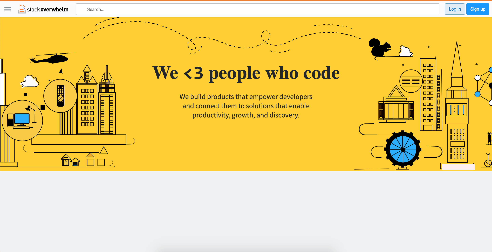

# Stack Overwhelm

## Overview
Stack Overwhelm is an online question forum modeled after [Stack Overflow](https://stackoverflow.com)

Acess the live site [here](http://stackoverwhelm.herokuapp.com/) or at (http://stackoverwhelm.herokuapp.com/)

W
## Features

+ **Questions and Answers** - Field questions and answers to a community of programmers and enthusiasts!

+ **Voting** - Reward intriguing questions and insightful answers with upvotes; Downvote responses that require revisions.

## Technologies
+ StackOverwhelm is built using React and Redux to manage frontend with Ruby on Rails PostgreSQL managing the backend and database, respectively. 

## Code highlights

A custom text input was implemented for
